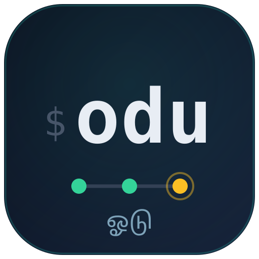

# odu



**A CI runner you attach to.** odu (Tamil ஓடு — *run*) runs your
[`just`](https://just.systems) recipe DAG across machines, posts GitHub
commit statuses, and — unlike every batch CI tool — holds the run as **live,
typed state you can attach to** from a terminal dashboard while it runs.

```
$ odu run                      # the whole DAG — local by default, or every configured platform
$ odu attach                   # attach a live dashboard to the run (other terminal)
$ odu logs -f e2e@x86_64-linux # follow one node's output
```

> [!TIP]
> New here? Read the announcement — [**Introducing odu**](https://kolu.dev/blog/odu/) — for the story behind it and **video demos** of a live run and the agent face.

## Why

Local CI tools translate your task graph into a batch process, run it, and
leave you log files. Want to know what's happening mid-run? You scrape logs
or poll a process supervisor's socket with a separately-versioned client.

odu inverts that. The runner *owns* the pipeline as state and serves it as
three typed primitives over plain ssh (an [oRPC](https://orpc.io) contract,
base64-framed over stdio — no daemons, no ports, no agents to install):

| Primitive | Call | What it carries |
| --- | --- | --- |
| **Cell** | `surface.nodes.get({})` | The whole pipeline's state — one snapshot, then deltas as nodes change. |
| **Stream** | `surface.nodeLog.get({ id })` | One node's output — a buffered snapshot first (late subscribers replay from the top), then appends. |
| **Procedure** | `surface.node.rerun({ id })` | The *only* mutation: reset a node + its transitive dependents and reschedule. |

Every face is a thin adapter over the same contract: the bundled terminal
dashboard and an **MCP server for coding agents** (`odu mcp`) today; a web
dashboard is designed on the same surface (see the roadmap below).

## How a run works

```
odu run  (coordinator, your machine)
 ├─ strict gate: refuse a dirty tree, pin HEAD via `git worktree`
 ├─ ingest: `just --dump` → the [metadata("ci")] recipe's dependency DAG
 ├─ per platform lane (hosts.json pool → lease a free host):
 │    nix copy the runner derivation → realise on the host →
 │    ssh host odu-runner --stdio → configure over the surface →
 │    the host fetches your pushed SHA into a writable per-SHA workspace
 │    and runs each node as `just --no-deps <recipe>`
 ├─ fan-in: lane states merge into one surface, served on .ci/odu.sock
 │    (odu status / logs / attach dial it, live)
 ├─ logs: .ci/<sha>/<platform>/<recipe>.log — durable even if the runner dies
 ├─ record: .ci/<sha>/runs/<seq>.json — the run's durable verdict + identity
 │    (repo, sha, seq), listable with `odu runs` after the coordinator exits
 └─ GitHub: commit status per <recipe>@<platform> context, posted on
    transitions read from the state cell (credentials never leave your machine)
```

A lane host needs **ssh + Nix + outbound https**. Nothing else: the runner
binary travels as a Nix closure, the toolchain comes from your repo's dev
shell, and the source arrives by `git fetch` of the pushed SHA.

That runner derivation is **odu's own**, not your repo's: the generic
`odu-runner` (odu's tsx wrapper + a fixed git/just/node toolchain) carries none
of your code, so the coordinator resolves it from odu's flake — baked onto the
`odu` binary as `ODU_RUNNER_FLAKE` (`self.outPath`) at build time — and your
repo never re-exports it. There is no override or fallback: the runner is always
the exact build that shipped the coordinator (they share an RPC contract), so
"use a different runner" just means "run a different odu".

## Install / run

Nothing to install — run odu straight from the flake against the current repo:

```sh
nix run github:juspay/odu -- run               # a strict CI run
nix run github:juspay/odu -- run --no-strict   # dev iteration: dirty tree OK, no GitHub writes
```

## Configure your repo

### Tag the pipeline DAG

Exactly one recipe carries `[metadata("ci")]`; its dependency closure *is* the
pipeline odu runs:

```just
[metadata("ci")]
default: build test lint
```

### Where the lanes run

**A host is a decision — `odu run` never guesses one.** odu resolves hosts from
the first of these that exists — `$ODU_HOSTS` (a filesystem path to a hosts
file, taking precedence) → `~/.config/odu/hosts.json` → `~/.config/justci/hosts.json`
— and if none configures a platform, a bare `odu run` **refuses** rather than
quietly running the whole pipeline on your own machine. (A missing config once
resolved silently to a `localhost` lane and fork-bombed a production
workstation — [#46](https://github.com/juspay/odu/issues/46). Running locally is
a fine choice; making it *by default, silently* is not.) The refusal names the
chain it checked and how to opt in.

```sh
odu run            # no hosts configured → refuses, names the resolution chain
```

**Run on this machine, on purpose.** Name your platform's lane `localhost`,
either for one run or in a hosts file:

```sh
odu run --host x86_64-linux=localhost      # this run only
```

```json
{ "x86_64-linux": "localhost" }
```

A `localhost` lane runs directly against your toolchain (skipping the Nix
closure copy). This single-machine case is what most users want — it just has to
be asked for.

**Multi-platform (fan out across machines).** To run each platform's lane on a
real builder for that platform, list them in `~/.config/odu/hosts.json` (or set
`$ODU_HOSTS` to a hosts file elsewhere):

```json
{
  "x86_64-linux": "my-linux-builder",
  "aarch64-darwin": "me@mac-mini.local"
}
```

Keys are Nix system tuples; values are anything ssh can dial, or `localhost`.
A bare `odu run` then fans out to **every** configured platform at once;
platforms absent from an *existing* config simply drop from the fanout (a
partial config is a decision), and `--platform P` slices to a subset.

**Venue pools (one free machine per platform).** A platform can name a **list**
of hosts instead of one — odu picks a free machine, locks it for the run, and
releases it when the run ends (or the process dies). A plain string still means
a pool of one:

```json
{
  "x86_64-linux": ["nix@ci-1", "nix@ci-2", "nix@ci-3", "nix@ci-4"],
  "aarch64-darwin": ["nix-infra@rasam.example.ts.net", "srid@sincereintent"]
}
```

Rules (juspay/odu#54):

- One run per machine at a time. The lock is an `flock` **on the target
  machine**, held over a long-lived ssh connection with heartbeats — so
  laptops/agents contend correctly with no lock server. Crash / SIGKILL /
  half-open network all free the lock when heartbeats stop.
- Every machine busy → wait in line (and say who you're waiting for).
  `--no-wait` fails immediately instead.
- `--host x86_64-linux=ci-2` still pins a specific machine (waits if busy).
- `localhost` is never leased (the checkout socket already serializes local runs).
- Empty pool / no reachable host → loud error. Never localhost by accident.

`odu hosts` probes the inventory without acquiring:

```
HOST            PLATFORM        STATE   HELD BY
ci-1            x86_64-linux    busy    grok@desk · e9f0a1b#1 · 2m
ci-3            x86_64-linux    free
rasam           aarch64-darwin  busy    srid@laptop · a1b2c3d#4 · 6m
```

Builders need `flock(1)` (util-linux) on PATH. The lock file defaults to
`/tmp/odu.lease` (`ODU_LEASE_LOCK` to override).

**Scope a recipe to the coordinator's own OS family.** By default every recipe
fans out to every configured platform. Tagging a recipe with `just`'s built-in
[OS attributes](https://just.systems/man/en/attributes.html) — `[linux]`,
`[macos]`, `[unix]`, `[windows]`, … — keeps it off the lanes whose OS it
doesn't name:

```just
[linux]
nix-bundle:
    nix bundle .#app  # dropped from the macOS lane
```

A tagged recipe is pruned from the lanes whose OS it doesn't name, and **so is
anything that depends on it** — a step needing a `[linux]`-only recipe drops
from the macOS lane too, so no lane is ever left a node whose dependency was
pruned. Multiple OS attributes are OR-ed (`[linux]` + `[macos]` ⇒ both), and an
untagged recipe still fans out everywhere. `odu protect` requires exactly the
filtered contexts, so an OS-scoped recipe is never required on a lane that can't
post it.

> **Limitation — same-OS only.** odu reads the pipeline once on the coordinator
> via `just --dump --dump-format json`, and `just` resolves OS attributes
> *before* emitting that JSON: a recipe whose attribute doesn't match the
> coordinator's OS is absent from the dump entirely (and a recipe that *depends*
> on a cross-OS recipe makes `just --dump` fail). So OS attributes reliably
> **prune** a recipe off non-matching lanes when odu runs on the OS the recipe
> targets — e.g. a Linux coordinator dropping a `[linux]` recipe from the macOS
> lane. They cannot **introduce** a recipe onto a foreign-OS lane: a `[macos]`
> recipe is invisible to a Linux coordinator and so never schedules anywhere.
> Run each OS family's exclusive recipes from a coordinator on that OS.

## CLI

```
odu run [recipe[@platform]…]      run (selectors compose; bare names fan out
                                  to every platform)
    --platform P (repeatable)     slice the fanout
    --host P=ADDR (repeatable)    one-shot host pin
    --root NAMEPATH               alternative DAG root
    --no-deps                     skip the dependency closure
    --no-post                     strict, but no GitHub writes
    --no-snapshot                 live tree, implies --no-post
    --no-strict                   ≡ --no-snapshot --no-post (dev iteration)
    --progress json               one NDJSON line per node transition
    --supersede                   cancel a run already live here, then start
    --linger                      keep serving after settle (rerun a node later)
    --no-wait                     fail if every host in a pool is busy
                                  (default: wait in line)
odu status [-o json]              snapshot a live run
odu logs [-f] <node>              replay (+ follow) one node's log
odu attach [-o json]              live dashboard (tty); piped, -o json
                                  matches run --progress json, else run's
                                  plain transition stream
odu cancel                        stop the live run in this checkout, cleanly
odu runs [-o json]                the durable run history (works with no live run)
odu hosts                         venue inventory (free / busy / held by)
odu dump | graph                  resolved pipeline as JSON / Mermaid
odu protect [--dry-run]           sync branch protection's required contexts
    --platform P (repeatable)     the repo's platform set — needs no hosts
                                  config; default derives from the machine's
                                  hosts file (and says so on stderr)
    --branch B                    branch to protect (default: repo default)
odu mcp                           serve the agent face (MCP server, stdio)
```

**Strict by default**: a real CI run refuses a dirty tree, tests the pinned
HEAD commit, posts statuses. The opt-outs exist for dev iteration, not CI.

**Cancelling a run.** A run is owned by its coordinator, but `.ci/odu.sock` lets
a *second* process stop it: `odu cancel` dials the live run and drives the same
teardown a Ctrl-C does — finalize the posted statuses (no eternally-pending
checks), close the lanes, drop the socket — then waits until it's gone. So you
needn't wait out a run you know is doomed, or `pkill` a coordinator pid by hand.
`odu run --supersede` rolls cancel + start into one: it cancels whatever's live
here before binding the lock, which is the "stop this, run the fixed commit"
move after a fail-fast. By default a run exits the instant it drains; `--linger`
keeps the coordinator serving past settle so you can rerun a node afterwards
(e.g. retry a flake) — it self-reaps after an idle period, or on `cancel`.

## Drive CI from an agent (MCP)

`odu mcp` serves odu's surface as an [MCP](https://modelcontextprotocol.io)
server over stdio, so a coding agent (Claude Code, Codex, opencode, Gemini CLI)
drives CI with structured calls instead of scraping your terminal. It is
*in-band*, like `status` / `logs` / `attach`: it dials the `.ci/odu.sock` of a
run in the current repo and predetermines no host — which boxes run the lanes
stays the coordinator's job (pool lease / `hosts.json`).

The face is a projection of odu's own [`@kolu/surface`](https://github.com/juspay/kolu)
through [`@kolu/surface-mcp`](https://github.com/juspay/kolu): the coordinator
surface is re-exposed as a default-deny MCP face — only what's declared reaches
the agent.

| Tool | What it does |
| --- | --- |
| `run` | Start a run (background coordinator) and return once it's live. `supersede` cancels a run already live here first; `linger` keeps it serving past settle; `no_wait` fails if every host in a pool is busy. |
| `node_rerun` | Reset a node + its dependents and reschedule (the only *node* mutation). |
| `wait_for_settle` | Block until the run settles, or — fail-fast — the instant a node goes red. The verdict carries the run's identity — `sha7` always, and a non-null `seq` completing the unique `sha7#seq` (null only when no ordinal was reserved) — so you know *which* run it describes. Fails **loud** (an error, not an empty verdict) when no run is live here, or — with `expected_sha` — when the live run's commit doesn't match. |
| `cancel` | Stop the live run and wait until it's torn down, so a following `run` can start. |
| `runs` | The durable run history — each recorded run's `sha#seq`, outcome, timing, lanes, and per-node results, newest first. Reads the on-disk ledger, so it answers *after* the coordinator has exited (the agent-face analogue of `odu runs`). |

The pipeline snapshot and per-node logs are **subscribable resources** rather
than tools: `surface://streams/nodes` (the pipeline as
`{ run, pipeline, sha7, seq, nodes[] }` — the run's identity plus every node's
status / exit / duration + the `red` verdict bit) and
`surface://collections/logs/{id}` (one node's output — the live buffered
snapshot while a run is up, else the durable per-SHA log). Both support
`resources/subscribe` + `notifications/resources/updated` on every transition.
`wait_for_settle` is the blocking-pull floor for hosts that don't wake the model
on a notification.

The agent loop is `run` → `wait_for_settle` (fail-fast) → read the red node's
`surface://collections/logs/{id}` → fix → `node_rerun`. Fail-fast is the point:
`wait_for_settle` returns the *instant* the first node goes red — that early
return (`fail_fast_tripped: true`, `settled: false`) is the unblock signal, so
the agent never waits out the slow lanes just to "see full status". Its
`failed[]`/`errored[]` are only what's red *so far* — a floor, not the tally;
`passed: true` (a fully settled run, zero red) is the only trustworthy green.
A verdict about an observed run carries that run's identity — `sha7` always, and
`seq` (the reserved ordinal, i.e. `sha7#seq`) whenever the coordinator reserved
one — so you match it to the run you dispatched rather than a previously-settled
one; pass `expected_sha` (a full sha or a `sha7` prefix) to make that a hard
check. *(`seq` is `null` only when no ordinal was reserved: a wait that saw no
frame at all, or the rare case where the coordinator couldn't durably reserve a
seq — then the run claims `sha7` but no unique `sha7#seq`.)* And
`wait_for_settle` never returns an empty nothing-verdict: called with **no run
live** in the checkout it fails loud with the same "no run in progress" message
as `odu status`, so a stale/no-run call is unmistakable rather than an instant
`settled: false`.
The coordinator keeps running after the tool returns, so `node_rerun` retries a
fixed node against the still-live run and `wait_for_settle` again catches any
later reds. When the right next move
is a fresh run instead — wrong commit, or the fix is a new commit — `run` with
`supersede` calls off the live run and starts over in one step; `cancel` calls
off a run you no longer need at all (so the loop never strands a pipeline or
hits "a run is already in progress"). Declare it over stdio:

```jsonc
// .mcp.json (Claude Code; Codex / opencode / Gemini CLI take the same shape)
{ "mcpServers": { "odu": {
  "type": "stdio",
  "command": "nix",
  "args": ["run", "github:juspay/odu", "--", "mcp"] } } }
```

Repos that manage agent config with [APM](https://github.com/juspay/apm) get
this wired automatically by depending on `juspay/odu`: odu's `apm.yml` declares
the MCP server, deploying the `odu-mcp` launcher and the `.mcp.json` entry into
the consumer's tree (set `ODU_FLAKE=.#odu` to use a repo's own pinned odu
instead of `github:juspay/odu`).

## Honest notes

- **Pushed SHAs only on remote lanes.** Hosts fetch your commit from the
  origin remote (anonymous https). odu does not ship git bundles, so a
  remote lane can't test an unpushed commit. Localhost lanes can.
- **Live-tree mode is localhost-only.** `--no-snapshot`/`--no-strict` run the
  live working tree, but only a localhost lane sees it — a remote lane still
  fetches the committed HEAD. So on a *dirty* tree odu refuses remote lanes in
  live mode rather than hand back a verdict that silently tested stale code;
  slice to local platforms with `--platform`, or commit+push for a remote run.
- **One-shot lanes.** If the ssh link to a lane dies mid-run, that lane's
  unfinished nodes are marked `errored` (GitHub state `error`) and the run
  fails — live *node* state does not survive a runner restart in Phase 1; the
  per-SHA log files and the run record (see below) do.
- **One run per checkout.** `.ci/odu.sock` is the lock; a second `odu run`
  in the same checkout refuses to start — `odu cancel` (or `odu run
  --supersede`) frees the lock first.
- **Run history is durable; live attach to a finished run is not.** Every
  terminal run writes a `(repo, sha, seq)` record to `.ci/<sha>/runs/<seq>.json`
  — `odu runs` lists them with no coordinator live (an interrupted run records
  too, marked incomplete). **`status` / `logs` / `attach` take no run selector**:
  they dial `.ci/odu.sock` and only ever target the run *in progress* (with none
  live, `odu status` exits 1) — there is no `odu status <sha#seq>` for an old
  run. To inspect a finished run, read `odu runs -o json`, whose record carries
  each node's status / exit / duration. What's *not* yet here is the live half:
  re-attaching the `nodes` / `nodeLog` surface (or a `status`-style detail view)
  to a run that already finished, and a long-lived idle runner you reach before a
  run starts — both Phase-2 (`odu serve`) territory.

## Developing

```sh
just install     # pnpm install + hydrate @kolu/* from the npins kolu pin
just typecheck
just test        # unit tests — the loopback falsifiability suite
just e2e         # black-box e2e — nix-build odu, drive it against a fixture repo
just run -- run --no-strict fmt   # one recipe, locally, against the live tree
```

odu consumes the [`@kolu/surface`](https://github.com/juspay/kolu/tree/master/packages/surface)
libraries **upstream, not vendored** — the
[drishti](https://github.com/srid/drishti) pattern: `npins` pins
`juspay/kolu`, `nix/overlay.nix` extracts each package as a store path, and
`scripts/hydrate-kolu-packages.sh` copies the raw TypeScript into
`node_modules/@kolu/` (`just update-pins` to advance the pin). The repo runs
its own CI with itself: `nix run .#odu -- run` against the
`[metadata("ci")]` DAG in `ci/mod.just`.

## Lineage and roadmap

odu grew out of kolu's `mini-ci` example, replaced
[justci](https://github.com/juspay/justci) as the kolu repo's own CI
([juspay/kolu#1252](https://github.com/juspay/kolu/pull/1252) — same status
contexts, same per-SHA log layout, same strict-mode flag table, so the
migration was invisible to branch protection), and then graduated here, the
way kolu's remote-process-monitor example became
[drishti](https://github.com/srid/drishti). The design history, the justci
comparison, and the phased roadmap (the web face) live in the kolu Atlas:
[*A CI runner you attach to*](https://htmlpreview.github.io/?https://raw.githubusercontent.com/juspay/kolu/master/docs/atlas/dist/mini-ci-vs-justci.html).

License: AGPL-3.0-or-later.
